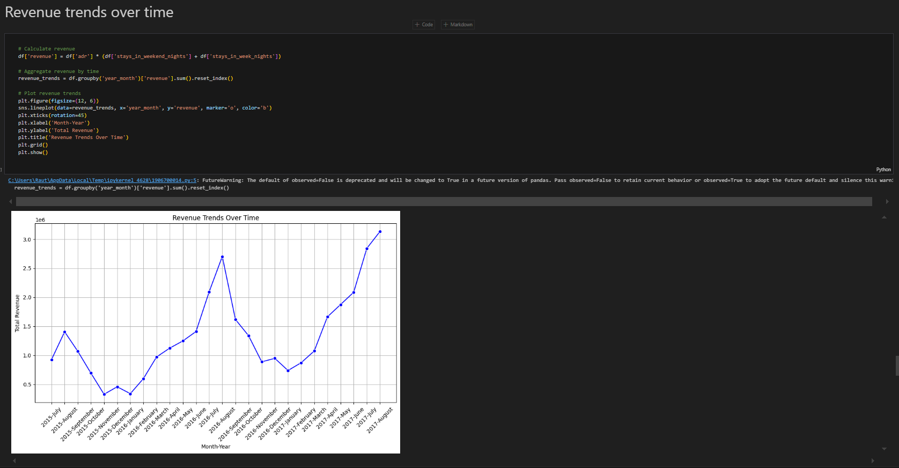
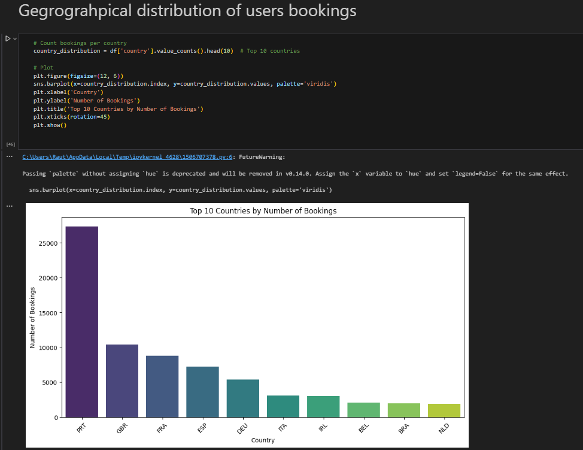
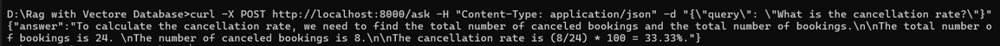
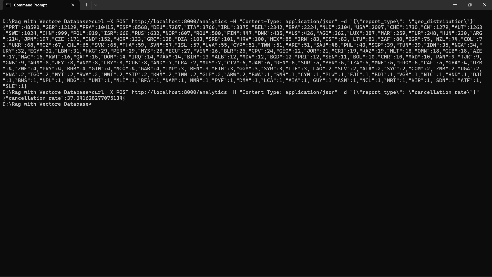

# LLM-Powered-Booking-Analytics-QA-System

This repository contains multiple projects designed to work with hotel booking data. The projects include a Streamlit application, FastAPI endpoints for querying data and analytics, and a Jupyter Notebook for data preprocessing and exploratory analytics.

## Repository Structure

- **Data_preprocessing_and_analysis.ipynb**  
  A Jupyter Notebook that includes data preprocessing tasks such as:
  - Filling missing values
  - Removing duplicates and handling inconsistencies
  - Performing exploratory data analytics on the hotel booking dataset

- **App.py**  
  A [Streamlit](https://streamlit.io/) LLM powered application(using RAG) that allows you to interact with hotel booking data uploaded as a CSV file. Use this interactive chatbot to solve your query.

- **Booking_query_api.py**  
  A FastAPI-based service that provides an API endpoint for querying hotel booking data. Post your queries to this API to receive responses based on the underlying data analysis.

- **Booking_analytics_api.py**  
  Another FastAPI service that exposes endpoints to retrieve specific analytics or all available analytics computed on the dataset. This service lets you fetch insights programmatically.

## Getting Started

### Prerequisites

Ensure you have the following installed:
- Python 3.10+
- [Streamlit](https://docs.streamlit.io/)
- [FastAPI](https://fastapi.tiangolo.com/) and a compatible ASGI server (e.g., [uvicorn](https://www.uvicorn.org/))
- Jupyter Notebook (if you plan to run the 'Data_preprocessing_and_analysis' notebook)
-  Configuration

    Ensure you have set your Groq API key in the environment variable:

    ```sh
    export GROQ_API_KEY=your_api_key_here
    ```


- You can install the Python dependencies using pip:

  ```sh
  pip install -r requirements.txt 
  ```

## 🤖Setup

### Clone the repository

```bash
git clone https://github.com/siddhant1721/-LLM-Powered-Booking-Analytics-QA-System-
```
## ▶️Running the Applications

### 📅Data_preprocessing_and_analysis
run the jupyter notebook

### 💻Streamlit LLM App

To launch the Streamlit app:

```bash
streamlit run "path to your file"
```
### 📃Booking Analytics API

This API processes hotel booking data and provides various analytics reports.

#### Getting Started

1. **Start the Server:**  
   Run the Python file to start the FastAPI server. For example:
   ```sh
   python Booking_analytics_api.py
   ```
2. You should see output indicating the server is running on `http://0.0.0.0:8000`.

   #### Test the API Endpoints Using cURL

      Make sure you have cURL installed. Open your command prompt and use the following commands:

   ### For All Reports:
      ```sh
      curl -X POST http://localhost:8000/analytics -H "Content-Type: application/json" -d "{\"report_type\": \"all\"}"
      ```   
   ### For Revenue Trends:
      ```sh
      curl -X POST http://localhost:8000/analytics -H "Content-Type: application/json" -d "{\"report_type\": \"revenue_trends\"}"
      ```  
   ### For Cancellation Rates:
      ```sh
     curl -X POST http://localhost:8000/analytics -H "Content-Type: application/json" -d "{\"report_type\": \"cancellation_rate\"}"
      ```  

   ### For Geographical Distribution:
      ```sh
     curl -X POST http://localhost:8000/analytics -H "Content-Type: application/json" -d "{\"report_type\": \"geo_distribution\"}"
      ```  
   ### For Booking Lead Time:
      ```sh
    curl -X POST http://localhost:8000/analytics -H "Content-Type: application/json" -d "{\"report_type\": \"booking_lead_time\"}"
      ```              


### 🤔Booking_query_api

1. Start the Server

      Run this command in your terminal (make sure to change to the correct directory):

      ```sh
      uvicorn Booking_query_api:app --host 0.0.0.0 --port 8000
      ```
2. Query the api

    ```sh
    curl -X POST http://localhost:8000/ask -H "Content-Type: application/json" -d "{\"query\": \"What is the cancellation rate?\"}"
    ```

## 🏷️Report 

### 📝 Overview

This project provides a comprehensive platform for analyzing and interacting with hotel booking data. It features data preprocessing, exploratory data analysis, an interactive chatbot, and API endpoints for programmatic data access and analytics.

### 🚀 Features & Implementation

### 1. Data Preprocessing & Analysis (`Data_preprocessing_and_analysis.ipynb`)

#### Implementation Details
- **Missing Value Handling**: Implemented conditional imputation for missing values based on category and context
- **Duplicate Detection**: Used composite key approach combining reservation date, guest details, and room type
- **Data Normalization**: Standardized country codes and currency values for consistency
- **Conflicting data**: Hotel booking record were present for children and adult value was 0.
- **Feature Engineering**: Created derived features such as 'Revenue trends over time','Cancellation rate as percentage of total bookings','booking_lead_time' and 'total_guests'

#### sample output




### 2. LLM-Powered Interactive Query Interface (`App.py`)

#### Implementation Details
- **RAG Architecture**: Implemented hybrid retrieval combining dense and sparse vectors
- **Vector Database**: Used ChromaDB for efficient similarity search

#### sample ouput
.png)

#### Challenges & Solutions
- **Challenge**: Hallucination in LLM responses not backed by data.Converting a CSV into a long text string often loses its inherent structure and context. This lead to ambiguity when retrieving relevant information, causing the LLM to fill gaps with invented details.
- **Challenge**: Poor retrieval for numerical queries

  - **Solution**: We can build an AI agent that directly retrieves or computes data from a PostgreSQL database using a query language. This agent then feeds the structured, precise data to an LLM, which refines and augments the answer in the QA system—ensuring factual accuracy and reducing hallucinations.
 
- **Challenge**: Slow response times with large datasets for embedding 
  - **Solution**: Implementing tiered caching system for frequent queries and pre-computed embeddings

### 3. Query API Service (`Booking_query_api.py`)

#### Implementation Details
- **API Design**: RESTful architecture with JSON request/response format
- **Query Processing**: Developed natural language parsing for extracting query intent
- **Average response time:**:1.1 sec

#### Challenges & Solutions
- **Challenge**: Server response time delays due to embedding generation and hardware limitations
  - **Solution**: Implemented batch embedding processing and optimized model quantization to reduce memory footprint while maintaining performance
- **Challenge**: Hallucination in LLM responses not backed by data
  - **Solution**: Implemented fact verification system that cross-references generated responses with retrieved data points and filters out unsupported statements

#### sample output:
  

### 4. Analytics API Service (`Booking_analytics_api.py`)

#### Implementation Details
- **Metrics Pipeline**: Created pre-computed analytics updated on schedule
- **Endpoint Structure**: Designed hierarchical endpoint structure for intuitive access
- **Average response time:**

#### sample output:


